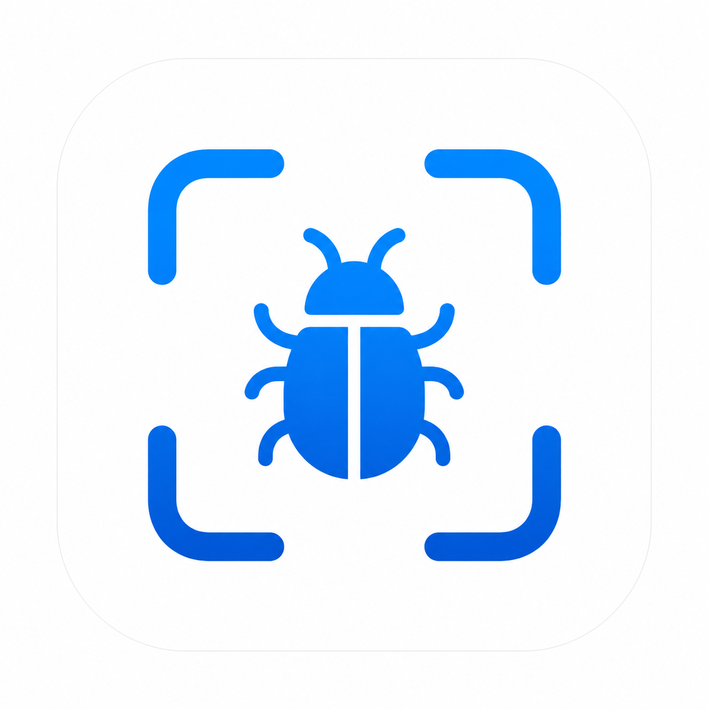

<div align="center">
  
  <h1 align="center">Catat</h1>
  <p align="center">
    <strong>Bug Report Companion for QA Engineers</strong>
    <br />
    Capture. Annotate. Export. In 30 seconds.
    <br />
    All data on device. Zero cloud dependencies.
  </p>

  <p align="center">
    
    
    
    
    
    
  </p>
</div>

Catat is an Android app that helps QA engineers file better bug reports faster. A floating button lets you capture screenshots from any app, annotate with arrows and blur, and export formatted reports to Jira, GitHub Issues, Linear, or Markdown. All in under 30 seconds.

## Why

Every day as an SDET, I spent 30 to 60 minutes on administrative tasks. Taking screenshots. Copying device info. Formatting steps to reproduce. This time should be spent on actual testing, not paperwork. I built Catat because QA tools should be built by people who actually do QA.

## How

| Feature | Implementation |
|---------|---------------|
| Screen Capture | `MediaProjectionManager` + `VirtualDisplay` + `ImageReader` |
| Floating Overlay | `WindowManager` + `AccessibilityService` |
| Annotation | Custom `Canvas` engine with Arrow, Rectangle, Text, Pen, and StackBlur |
| Export | Template engine supporting Jira, GitHub Issues, Linear, and Markdown |
| Storage | `Room` + `FileStorage` with everything local |
| Preferences | `DataStore` for theming, defaults, and onboarding state |
| Testing | `JUnit 5` + `MockK` + `Espresso` + Kotest property-based testing |
| CI/CD | `GitHub Actions` with lint, build, unit test, and coverage gate at 80% |

## Features

- Floating action button for instant screenshots from any app
- Five annotation tools: arrow, rectangle, text, freehand pen, and blur for sensitive data
- Auto-attached context with device model, OS version, network type, battery level, and app info
- One tap export formatted for Jira, GitHub Issues, Linear, or Markdown
- Full offline support with reports saved locally
- Dark mode that follows system theme
- TalkBack accessibility with 48dp touch targets and dynamic type

## Tech Stack

| Layer | Technology |
|-------|-----------|
| Language | Kotlin 2.0 |
| UI | Jetpack Compose + Material 3 |
| Architecture | Clean Architecture + MVVM |
| DI | Hilt |
| Database | Room with FTS4 virtual table |
| Storage | DataStore + FileStorage |
| Capture | MediaProjection API + ImageReader |
| Testing | JUnit 5, MockK, Espresso, Kotest |
| CI/CD | GitHub Actions |

## Screenshots

<div align="center">
  
  
  
  
</div>

*Screenshots will be added after UI polish is complete.*

## Getting Started

### Prerequisites

- Android Studio Hedgehog (2023.1.1) or later
- JDK 17
- Android SDK API 34
- Emulator running API 28+ (Pixel 6 Pro recommended)

### Build and Run

```bash
git clone https://github.com/theobuilds/catat-app.git
cd catat-app

./gradlew assembleDebug
./gradlew testDebugUnitTest
./gradlew koverHtmlReportDebug

adb install app/build/outputs/apk/debug/app-debug.apk
```

### Permissions

Catat requests these permissions on first run:

1. **Draw over other apps** for the floating capture button
2. **Media projection** to capture screenshots
3. **Notifications** to keep the capture service alive (API 33+)

All permissions are used exclusively for bug reporting. No data leaves your device.

## Project Structure

```
catat-app/
├── app/src/main/java/com/catat/app/
│   ├── CatatApplication.kt       Hilt application entry point
│   ├── di/                       Dependency injection modules
│   ├── domain/                   Business logic and models
│   │   ├── model/                Domain entities
│   │   ├── repository/           Repository interfaces
│   │   └── usecase/              Application use cases
│   ├── data/                     Data layer
│   │   ├── db/                   Room database and DAOs
│   │   ├── repository/           Repository implementations
│   │   ├── datastore/            Preferences storage
│   │   └── storage/              File storage
│   ├── presentation/             UI layer
│   │   ├── theme/                Design system
│   │   ├── navigation/           Screen routes
│   │   └── screen/               Seven screens
│   └── service/                  Capture overlay service
├── docs/                         Design documents
├── scripts/                      Test runner utilities
└── .github/workflows/            CI/CD pipeline
```

## Documents

| Document | Description |
|----------|-------------|
| [PRD](docs/01_PRD.md) | Product Requirements Document |
| [SRS](docs/02_SRS.md) | Software Requirements Specification |
| [Architecture](docs/03_ARCHITECTURE.md) | System architecture and design decisions |
| [Data Model](docs/04_DATA_MODEL.md) | Database schema and DAOs |
| [UX Flow](docs/05_UX_FLOW.md) | User flow and screen specifications |
| [Test Plan](docs/06_TEST_PLAN.md) | Testing strategy with 50+ scenarios |
| [CI/CD](docs/07_CI_CD.md) | Pipeline configuration |
| [Bug Log](docs/08_BUG_LOG_TEMPLATE.md) | Bug documentation with root cause analysis |
| [UI Spec](docs/UI_REDESIGN_SPEC.md) | Apple-inspired design tokens |
| [Commit Guide](COMMIT_GUIDE.md) | Git conventions and workflow |

## Contributing

Contributions are welcome.

1. Fork the repository
2. Create a feature branch (`git checkout -b feat/amazing-feature`)
3. Commit your changes (`git commit -m "feat: add amazing feature"`)
4. Push to the branch (`git push origin feat/amazing-feature`)
5. Open a Pull Request

All commits follow [Conventional Commits](COMMIT_GUIDE.md) format.

## License

Distributed under the MIT License. See [LICENSE](LICENSE) for more information.

---

<div align="center">
  Built for every Software Tester, QA Engineer, and Test Engineer.
</div>
